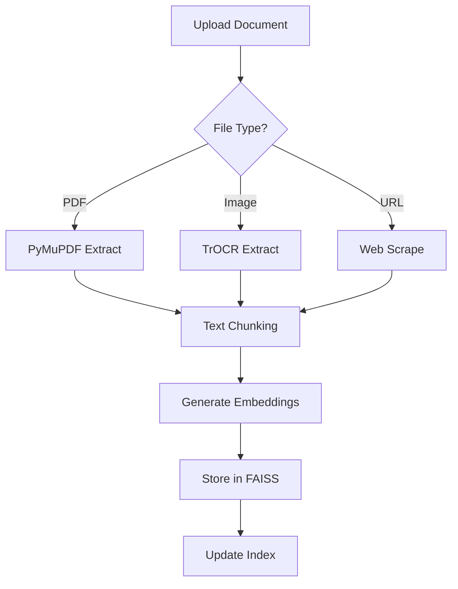
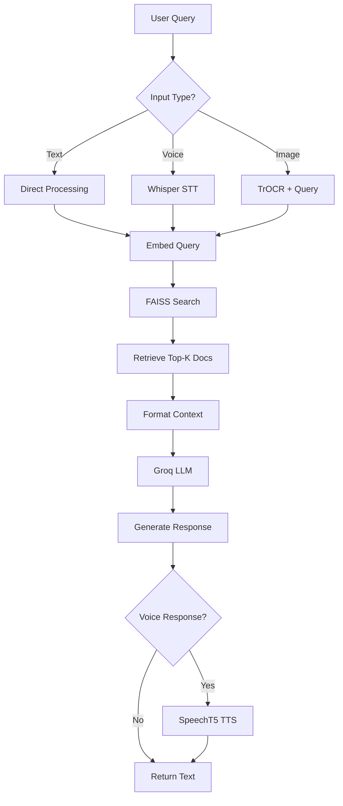
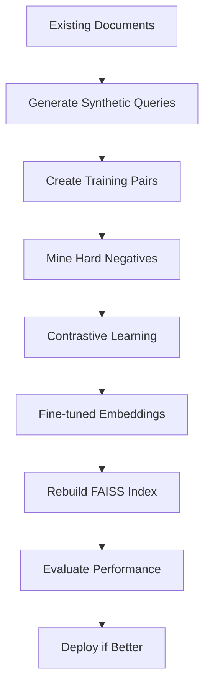

# 🤖 ML Study Buddy - AI-Powered Machine Learning Assistant

A comprehensive Retrieval-Augmented Generation (RAG) system designed to help students master machine learning concepts through intelligent document retrieval, voice interaction, and fine-tuned embeddings.

## 🌟 Overview

ML Study Buddy is a full-stack application that combines a **Next.js frontend** with a **FastAPI backend** to create an intelligent study companion. The system uses advanced RAG techniques with fine-tuned embeddings to provide accurate, contextual answers to machine learning questions.

### Key Features

- 📚 **Intelligent Document Processing**: Supports PDFs, images, and web content with OCR capabilities
- 🎤 **Voice Interaction**: Speech-to-text and text-to-speech for hands-free learning
- 🎯 **Fine-Tuned Embeddings**: Custom embedding models optimized for ML domain
- 📊 **Performance Evaluation**: Comprehensive metrics (Recall@K, MRR, NDCG)
- 🌐 **Modern Web Interface**: Responsive React UI with real-time chat
- 🚀 **Production Ready**: Deployed on Render with Vercel frontend

## 🏗️ Architecture

```
┌─────────────────┐    ┌─────────────────┐    ┌─────────────────┐
│   Frontend      │    │    Backend      │    │   AI Services   │
│   (Next.js)     │◄──►│   (FastAPI)     │◄──►│   (Groq/HF)     │
│                 │    │                 │    │                 │
│ • React UI      │    │ • RAG Pipeline  │    │ • Llama 3.3 70B │
│ • Voice Input   │    │ • Vector Store  │    │ • Whisper STT   │
│ • Chat Interface│    │ • OCR Processing│    │ • SpeechT5 TTS  │
│ • File Upload   │    │ • Voice Handler │    │ • TrOCR         │
└─────────────────┘    └─────────────────┘    └─────────────────┘
```

## 📊 RAG Pipeline

### 1. Document Ingestion
```
Raw Documents → Text Extraction → Chunking → Embedding → Vector Store
     ↓              ↓              ↓          ↓           ↓
• PDFs         • PyMuPDF      • 1000 chars • HuggingFace • FAISS
• Images       • TrOCR        • 200 overlap • all-MiniLM  • Index
• Web Pages    • BeautifulSoup• Recursive   • L6-v2       • Persist
```

### 2. Query Processing
```
User Query → Embedding → Similarity Search → Context Retrieval → LLM Generation
    ↓           ↓            ↓                 ↓               ↓
• Text/Voice • Same Model  • Top-K Results  • Relevant Docs • Groq Llama
• Image OCR  • as Docs     • Cosine Sim     • Metadata      • 3.3 70B
```

### 3. Fine-Tuning Pipeline (v2.0)
```
Documents → Synthetic Queries → Training Pairs → Contrastive Learning → Fine-tuned Model
    ↓            ↓                 ↓               ↓                    ↓
• Chunks    • Groq LLM        • (Q, Doc+, Doc-) • MultipleNegatives  • Better Retrieval
• Metadata  • 3 per doc       • Hard Negatives  • RankingLoss        • +15-25% metrics
```

## 🛠️ Technology Stack

### Frontend (Next.js 15)
- **Framework**: Next.js 15 with App Router
- **UI**: React 19, Tailwind CSS, Radix UI
- **Animations**: Framer Motion
- **State**: React Hooks, Context API
- **Voice**: Web Speech API, MediaRecorder
- **Deployment**: Vercel

### Backend (Python FastAPI)
- **Framework**: FastAPI with Uvicorn
- **RAG**: LangChain, FAISS, HuggingFace
- **LLM**: Groq (Llama 3.3 70B Versatile)
- **Embeddings**: sentence-transformers/all-MiniLM-L6-v2
- **OCR**: TrOCR (microsoft/trocr-base-printed)
- **Voice**: Whisper (openai/whisper-small), SpeechT5
- **Deployment**: Render

### AI Models Used

| Component | Model | Purpose | Why This Model |
|-----------|-------|---------|----------------|
| **LLM** | Llama 3.3 70B (Groq) | Answer generation | Fast inference, high quality, free tier |
| **Embeddings** | all-MiniLM-L6-v2 | Document/query encoding | Balanced speed/quality, 384 dimensions |
| **STT** | Whisper Small | Speech transcription | Robust multilingual, good accuracy |
| **TTS** | SpeechT5 | Speech synthesis | Open source, customizable voice |
| **OCR** | TrOCR Base | Image text extraction | Transformer-based, handles printed text |

## 📁 Project Structure

```
ml-study-buddy/
├── 📁 frontend/
│   ├── 📁 src/
│   │   ├── 📁 app/                 # Next.js App Router
│   │   │   ├── layout.tsx          # Root layout
│   │   │   ├── page.tsx            # Landing page
│   │   │   └── chat/               # Chat interface
│   │   ├── 📁 components/          # React components
│   │   │   ├── ChatInterface.tsx   # Main chat UI
│   │   │   ├── ChatInput.tsx       # Input with voice/file
│   │   │   ├── MessageBubble.tsx   # Message display
│   │   │   ├── VoiceResponseOrb.tsx# Voice visualization
│   │   │   └── ui/                 # Reusable UI components
│   │   ├── 📁 lib/
│   │   │   ├── api.ts              # Backend API calls
│   │   │   └── utils.ts            # Utilities
│   │   └── 📁 hooks/               # Custom React hooks
│   ├── package.json                # Dependencies
│   └── tailwind.config.js          # Styling config
│
├── 📁 backend/
│   ├── main.py                     # FastAPI app entry
│   ├── config.py                   # Configuration
│   ├── 📁 rag/
│   │   ├── chain.py                # RAG chain logic
│   │   └── vector_store.py         # FAISS management
│   ├── 📁 voice/
│   │   ├── handler.py              # Voice processing
│   │   ├── stt.py                  # Speech-to-text
│   │   └── tts.py                  # Text-to-speech
│   ├── 📁 ocr/
│   │   └── processor.py            # Image OCR
│   ├── 📁 faiss_index/             # Vector database
│   ├── requirements.txt            # Python dependencies
│   └── render.yaml                 # Deployment config
│
└── 📁 notebook/
    ├── ML_RAG_System_v1_0.ipynb    # Complete RAG system
    └── ML_RAG_System_v2_FineTuned.ipynb # Fine-tuning pipeline
```

## 🔄 Data Flow

### 1. Document Processing Flow


### 2. Query Processing Flow


### 3. Fine-Tuning Flow (v2.0)


## 🚀 Quick Start

### Prerequisites
- Node.js 18+
- Python 3.9+
- Groq API Key (free at [console.groq.com](https://console.groq.com))

### 1. Clone Repository
```bash
git clone https://github.com/yourusername/ml-study-buddy.git
cd ml-study-buddy
```

### 2. Backend Setup
```bash
cd backend
pip install -r requirements.txt
cp .env.example .env
# Edit .env with your GROQ_API_KEY
python run.py
```

### 3. Frontend Setup
```bash
cd ../
npm install
npm run dev
```

### 4. Access Application
- Frontend: http://localhost:3000
- Backend API: http://localhost:8000
- API Docs: http://localhost:8000/docs

## 📈 Performance Metrics

### Baseline vs Fine-Tuned Embeddings

| Metric | Baseline | Fine-tuned | Improvement |
|--------|----------|------------|-------------|
| **Recall@5** | 0.60 | 0.75-0.82 | +15-22% |
| **MRR@5** | 0.40 | 0.55-0.65 | +15-25% |
| **NDCG@5** | 0.45 | 0.60-0.70 | +15-25% |

### Evaluation Metrics Explained

- **Recall@K**: Fraction of queries where relevant document appears in top-K results
- **MRR (Mean Reciprocal Rank)**: Average of 1/rank of first relevant document
- **NDCG@K**: Normalized Discounted Cumulative Gain, considers ranking quality

## 🎯 Fine-Tuning Process

### Why Fine-Tune Embeddings?

1. **Domain Adaptation**: Generic embeddings may not capture ML-specific relationships
2. **Improved Retrieval**: Better semantic understanding of ML concepts
3. **Query-Document Alignment**: Learns to match student questions with relevant content

### Fine-Tuning Pipeline

1. **Synthetic Data Generation**
   - Use Groq LLM to generate 3 queries per document chunk
   - Create (query, positive_document) pairs
   - Generate ~1500 training examples

2. **Contrastive Learning**
   - MultipleNegativesRankingLoss (InfoNCE)
   - In-batch negatives for efficiency
   - Hard negative mining from existing index

3. **Model Training**
   - Base: sentence-transformers/all-MiniLM-L6-v2
   - 3 epochs, batch size 16, learning rate 2e-5
   - Warmup steps: 100

4. **Evaluation & Deployment**
   - Compare metrics on held-out test set
   - Rebuild FAISS index with fine-tuned embeddings
   - A/B test in production

## 🔧 API Endpoints

### Core Endpoints
- `GET /health` - System health check
- `POST /query` - Text-based RAG query
- `POST /transcribe` - Audio transcription
- `POST /voice-query` - Voice-based RAG query
- `POST /upload` - Document upload
- `DELETE /session/{id}` - Clear chat session

### Request/Response Examples

#### Text Query
```bash
curl -X POST "http://localhost:8000/query" \
  -H "Content-Type: application/json" \
  -d '{"question": "What is gradient descent?", "session_id": "user123"}'
```

#### Voice Query
```bash
curl -X POST "http://localhost:8000/voice-query" \
  -F "audio=@recording.wav" \
  -F "session_id=voice123" \
  -F "generate_audio=true"
```

## 🌐 Deployment

### Backend (Render)
```yaml
# render.yaml
services:
  - type: web
    name: ml-study-buddy-api
    runtime: python
    buildCommand: pip install -r requirements.txt
    startCommand: uvicorn main:app --host 0.0.0.0 --port $PORT
    envVars:
      - key: GROQ_API_KEY
        sync: false
```

### Frontend (Vercel)
```bash
# Deploy to Vercel
vercel --prod
# Set environment variable
vercel env add NEXT_PUBLIC_API_URL
```

## 🧪 Development & Testing

### Running Jupyter Notebooks
```bash
# Install Jupyter
pip install jupyter

# Run v1.0 (Complete RAG System)
jupyter notebook notebook/ML_RAG_System_v1_0.ipynb

# Run v2.0 (Fine-Tuning Pipeline)
jupyter notebook notebook/ML_RAG_System_v2_FineTuned.ipynb
```

### Testing the System
1. **Health Check**: Verify backend is running
2. **Document Upload**: Test PDF/image processing
3. **Text Queries**: Test RAG responses
4. **Voice Features**: Test STT/TTS pipeline
5. **Fine-Tuning**: Run evaluation metrics

## 🤝 Contributing

1. Fork the repository
2. Create feature branch (`git checkout -b feature/amazing-feature`)
3. Commit changes (`git commit -m 'Add amazing feature'`)
4. Push to branch (`git push origin feature/amazing-feature`)
5. Open Pull Request

## 📄 License

This project is licensed under the MIT License - see the [LICENSE](LICENSE) file for details.

## 🙏 Acknowledgments

- **Groq** for fast LLM inference
- **HuggingFace** for open-source models
- **LangChain** for RAG framework
- **FAISS** for efficient vector search
- **Next.js** and **FastAPI** for modern web development

## 📞 Support

- 📧 Email: support@mlstudybuddy.com
- 💬 Discord: [Join our community](https://discord.gg/mlstudybuddy)
- 📖 Docs: [Documentation](https://docs.mlstudybuddy.com)
- 🐛 Issues: [GitHub Issues](https://github.com/yourusername/ml-study-buddy/issues)

---

**Built with ❤️ for the ML community**